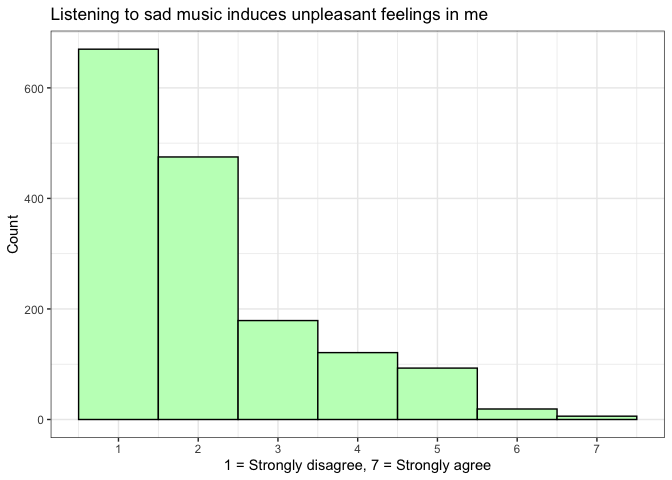

<!-- README.md is generated from README.Rmd. Please edit that file -->

# MusicScienceData

<!-- badges: start -->
<!-- badges: end -->

`MusicScienceData` is an R package that offers example datasets suitable
for exploration of basic analyses (correlation, comparison of means,
etc.) in music and science studies. There is behavioural data consisting
of ratings of emotional expression in soundtracks, consonance in chords,
and musical annotations of soundtracks as well as some acoustic features
extracted via `librosa python` script from the same files.

## Installation

The development version of this package can be installed from
[GitHub](https://github.com/) with:

``` r
# install.packages("devtools")
devtools::install_github("tuomaseerola/MusicScienceData")
```

## Example

These are the first four rows of the `chords` dataset in the library:

``` r
library(MusicScienceData)
d <- MusicScienceData::chords # Consonance ratings for 25 chords from Lahdelma & Eerola 2020
knitr::kable(d[1:4,],digits = 2)
```

| id         | rating | rating\_sd | rating\_se | pi\_chord | chord\_size | dataset |
|:-----------|-------:|-----------:|-----------:|:----------|------------:|:--------|
| DYA\_01\_1 |   2.04 |       1.23 |       0.17 | 59, 60    |           2 | lah20a  |
| DYA\_02\_1 |   3.15 |       1.12 |       0.16 | 55, 65    |           2 | lah20a  |
| DYA\_03\_1 |   3.33 |       1.11 |       0.16 | 57, 63    |           2 | lah20a  |
| DYA\_04\_1 |   3.87 |       1.07 |       0.15 | 56, 64    |           2 | lah20a  |

``` r
# Are Consonance ratings dependent on the chord size?
boxplot(rating ~ chord_size,data = d,col='lightblue')
```


## Datasets

Currently the following datasets are included:

| dataset               | Stim. N | Concepts                     | Study                   |
|:----------------------|:--------|:-----------------------------|-------------------------|
| chords                | 25      | Consonance ratings           | Lahdelma & Eerola 2020  |
| soundtrack            | 110     | Emotion ratings              | Eerola & Vuoskoski 2011 |
| soundtrack\_features  | 110     | Acoustic features            | Related to soundtracks  |
| sadness               | NA      | Attitudes towards sad music  | Eerola & Peltola 2016   |
| sadness\_AMS\_labels  | NA      | 25 questions included in ASM | Eerola & Peltola 2016   |
| annotations           | 100     | Annotations of 8 concepts    | Unpublished data        |
| annotations\_features | 100     | Acoustic features            | Unpublished data        |
| priming               | 64      | Reaction time responses      | Armitage & Eerola, 2020 |

## Another example: Attitude ratings

Here is an example of the `sadness` dataset that contains ratings of
attitudes towards sad music from a sample of participants.

``` r
knitr::kable(MusicScienceData::sadness[1:4,1:10])
```

| subj | age      | gender | listen  | expert | listensad | ASM1 | ASM2 | ASM3 | ASM4 |
|:-----|:---------|:-------|:--------|:-------|:----------|-----:|-----:|-----:|-----:|
| 1    | 35 to 44 | Female | d       | MusicL | Sometimes |    6 |    2 |    5 |    3 |
| 2    | 45 to 54 | Female | mult./d | MusicL | Often     |    2 |    6 |    6 |    3 |
| 3    | 18 to 24 | Female | d       | NM     | Sometimes |    6 |    5 |    5 |    5 |
| 4    | 25 to 34 | Male   | d       | Amat.  | Sometimes |    5 |    4 |    4 |    6 |

We can look at the distribution of the ratings to one of the questions
(ASM10 is the item 10):

``` r
library(ggplot2)
library(tidyverse)
MusicScienceData::sadness %>% 
  drop_na(ASM10) %>%
  ggplot(aes(x = ASM10))+
  geom_histogram(bins=7,fill="darkseagreen1", colour='black')+
  scale_x_continuous(breaks = seq(1,7,by=1))+ 
  ggtitle('Listening to sad music induces unpleasant feelings in me')+
  ylab('Count')+
  xlab('1 = Strongly disagree, 7 = Strongly agree')+
  theme_bw()+
  theme(plot.title = element_text(size=13))
```



## Citation

Eerola, T. (2021). MusicScienceData. Open datasets for Music and Science
Tutorials. <https://github.com/tuomaseerola/MusicScienceData>

## References

Armitage, J. & Eerola, T. (2020). Reaction Time Data in Music Cognition:
A Comparison of Pilot Data Sets from Lab, Crowdsourced and Convenience
Web Samples. *Frontiers in Psychology*.
<https://doi.org/10.3389/fpsyg.2019.02883>

Lahdelma, I. & Eerola, T. (2020). Cultural familiarity and musical
expertise impact the pleasantness of consonance/dissonance but not its
perceived tension. *Scientific Reports(10), 8693*.
<https://doi.org/10.1038/s41598-020-65615-8>

Eerola, T. & Peltola, H.-R. (2016). Memorable Experiences with Sad
Music: Reasons, Reactions and Mechanisms of Three Types of Experiences.
*PlosOne, 11(6)*, e0157444.
<http://dx.doi.org/10.1371/journal.pone.0157444>

Eerola, T. & Vuoskoski, J. K. (2011). A comparison of the discrete and
dimensional models of emotion in music. *Psychology of Music, 39(1)*,
18-49. <https://doi.org/10.1177/0305735610362821>
